# mju-cs-backend

## Table Of Contents

1. 0.0.1 Entities
   1. user(User)
   2. file(File)
   3. testimonials(Testimonial)
   4. course_group(CourseGroup)
   5. course(Course)
   6. program_course(ProgramCourse)
   7. program(Program)
   8. study_plan(StudyPlan)
   9. personnel_status(PersonnelStatus)
   10. personnel(Personnel)
   11. projects(Project)
   12. room_type(RoomType)
   13. building(Building)
   14. room(Room)
   15. features(Feature)
   16. events(Event)
   17. contact(Contact)
   18. complain(Complain)
   19. carousels(Carousel)
   20. article_image(ArticleImage)
   21. article(Article)
   22. about_contents(AboutContent)
   23. about_sections(AboutSection)
   24. alumni(Alumni)
2. ER Diagram

## 0.0.1 Entities

### user(User)

#### user(User) columns

| Database Name | Property Name | Attribute | Type        | Nullable | Charset | Comment |
| ------------- | ------------- | --------- | ----------- | -------- | ------- | ------- |
| id            | id            | PK        | \*uuid      |          |         |         |
| name          | name          |           | \*string    |          |         |         |
| email         | email         | UK        | \*string    |          |         |         |
| password      | password      |           | \*string    |          |         |         |
| roles         | roles         |           | \*text      |          |         |         |
| createdAt     | createdAt     |           | \*timestamp |          |         |         |
| updatedAt     | updatedAt     |           | \*timestamp |          |         |         |

#### user(User) indices

| Database Name                  | Property Name                  | Unique | Columns |
| ------------------------------ | ------------------------------ | ------ | ------- |
| UQ_e12875dfb3b1d92d7d7c5377e22 | UQ_e12875dfb3b1d92d7d7c5377e22 | Unique |         |

### file(File)

#### file(File) columns

| Database Name | Property Name | Attribute | Type        | Nullable | Charset | Comment |
| ------------- | ------------- | --------- | ----------- | -------- | ------- | ------- |
| id            | id            | PK        | \*uuid      |          |         |         |
| path          | path          |           | \*string    |          |         |         |
| createdAt     | createdAt     |           | \*timestamp |          |         |         |

### testimonials(Testimonial)

#### testimonials(Testimonial) columns

| Database Name | Property Name | Attribute | Type          | Nullable | Charset | Comment                                |
| ------------- | ------------- | --------- | ------------- | -------- | ------- | -------------------------------------- |
| id            | id            | PK        | \*uuid        |          |         |                                        |
| authorName    | authorName    |           | \*string(255) |          |         | ชื่อผู้ให้คำนิยม                       |
| authorTitle   | authorTitle   |           | \*string(255) |          |         | ตำแหน่งหรือบริษัท (เช่น CEO at Google) |
| content       | content       |           | \*text        |          |         | เนื้อหา                                |
| isActive      | isActive      |           | \*boolean     |          |         |                                        |
| createdAt     | createdAt     |           | \*timestamp   |          |         |                                        |
| updatedAt     | updatedAt     |           | \*timestamp   |          |         |                                        |
| deletedAt     | deletedAt     |           | timestamp     | Nullable |         |                                        |
| imageId       | image         | FK,UK     | uuid          | Nullable |         |                                        |

#### testimonials(Testimonial) indices

| Database Name                  | Property Name                  | Unique | Columns |
| ------------------------------ | ------------------------------ | ------ | ------- |
| REL_f41a4b77d07a498cc165024dc7 | REL_f41a4b77d07a498cc165024dc7 | Unique |         |

### course_group(CourseGroup)

#### course_group(CourseGroup) columns

| Database Name | Property Name | Attribute | Type     | Nullable | Charset | Comment |
| ------------- | ------------- | --------- | -------- | -------- | ------- | ------- |
| id            | id            | PK        | \*uuid   |          |         |         |
| name          | name          |           | \*string |          |         |         |
| credits       | credits       |           | number   | Nullable |         |         |
| parentId      | parent        | FK        | uuid     | Nullable |         |         |

### course(Course)

#### course(Course) columns

| Database Name  | Property Name  | Attribute | Type           | Nullable | Charset | Comment                                      |
| -------------- | -------------- | --------- | -------------- | -------- | ------- | -------------------------------------------- |
| id             | id             | PK        | \*uuid         |          |         |                                              |
| code           | code           | UK        | \*varchar(255) |          |         | รหัสวิชา                                     |
| titleTh        | titleTh        |           | \*varchar(255) |          |         | ชื่อวิชาภาษาไทย                              |
| titleEn        | titleEn        |           | \*varchar(255) |          |         | ชื่อวิชาภาษาอังกฤษ                           |
| description    | description    |           | text           | Nullable |         | รายละเอียดวิชา                               |
| credits        | credits        |           | \*number       |          |         | หน่วยกิต                                     |
| lectureHours   | lectureHours   |           | \*number       |          |         | จำนวนชั่วโมงเรียนทฤษฎีต่อสัปดาห์             |
| labHours       | labHours       |           | \*number       |          |         | จำนวนชั่วโมงเรียนปฏิบัติต่อสัปดาห์           |
| selfStudyHours | selfStudyHours |           | \*number       |          |         | จำนวนชั่วโมงศึกษาค้นคว้าด้วยตัวเองต่อสัปดาห์ |
| isActive       | isActive       |           | \*boolean      |          |         | สำหรับซ่อนรายวิชา                            |
| createdAt      | createdAt      |           | \*timestamp    |          |         |                                              |
| updatedAt      | updatedAt      |           | \*timestamp    |          |         |                                              |
| deletedAt      | deletedAt      |           | timestamp      | Nullable |         |                                              |

#### course(Course) indices

| Database Name                  | Property Name                  | Unique | Columns |
| ------------------------------ | ------------------------------ | ------ | ------- |
| UQ_5cf4963ae12285cda6432d5a3a4 | UQ_5cf4963ae12285cda6432d5a3a4 | Unique |         |

### program_course(ProgramCourse)

#### program_course(ProgramCourse) columns

| Database Name | Property Name | Attribute | Type        | Nullable | Charset | Comment |
| ------------- | ------------- | --------- | ----------- | -------- | ------- | ------- |
| id            | id            | PK        | \*uuid      |          |         |         |
| createdAt     | createdAt     |           | \*timestamp |          |         |         |
| updatedAt     | updatedAt     |           | \*timestamp |          |         |         |
| deletedAt     | deletedAt     |           | timestamp   | Nullable |         |         |
| programId     | program       | FK        | uuid        | Nullable |         |         |
| courseId      | course        | FK        | uuid        | Nullable |         |         |
| groupId       | group         | FK        | uuid        | Nullable |         |         |

### program(Program)

#### program(Program) columns

| Database Name | Property Name | Attribute | Type        | Nullable | Charset | Comment                           |
| ------------- | ------------- | --------- | ----------- | -------- | ------- | --------------------------------- |
| id            | id            | PK        | \*uuid      |          |         |                                   |
| code          | code          | UK        | \*varchar   |          |         | รหัสหลักสูตร                      |
| nameTh        | nameTh        |           | \*varchar   |          |         | ชื่อหลักสูตรภาษาไทย               |
| nameEn        | nameEn        |           | \*varchar   |          |         | ชื่อหลักสูตรภาษาอังกฤษ            |
| degreeThFull  | degreeThFull  |           | varchar     | Nullable |         | ชื่อเต็มปริญญาภาษาไทย             |
| degreeEnFull  | degreeEnFull  |           | varchar     | Nullable |         | ชื่อเต็มปริญญาภาษาอังกฤษ          |
| degreeTh      | degreeTh      |           | varchar     | Nullable |         | ชื่อย่อปริญญาภาษาไทย              |
| degreeEn      | degreeEn      |           | varchar     | Nullable |         | ชื่อย่อปริญญาภาษาอังกฤษ           |
| credits       | credits       |           | \*number    |          |         | จำนวนหน่วยกิตที่เรียนตลอดหลักสูตร |
| revision      | revision      |           | varchar     | Nullable |         | ปีที่ปรับปรังหลักสูตร             |
| duration      | duration      |           | varchar     | Nullable |         | ระยะเวลาของหลักสูตร               |
| languages     | languages     |           | varchar     | Nullable |         | ภาษาที่ใช้                        |
| isCurrent     | isCurrent     |           | \*boolean   |          |         | เป็นหลักสูตรปัจจุบันหรือไม่       |
| isActive      | isActive      |           | \*boolean   |          |         | แสดงผลบนหน้าเว็บหรือไม่           |
| createdAt     | createdAt     |           | \*timestamp |          |         |                                   |
| updatedAt     | updatedAt     |           | \*timestamp |          |         |                                   |
| deletedAt     | deletedAt     |           | timestamp   | Nullable |         |                                   |

#### program(Program) indices

| Database Name                  | Property Name                  | Unique | Columns |
| ------------------------------ | ------------------------------ | ------ | ------- |
| UQ_c6b8c4c1adba14ec96387d3c002 | UQ_c6b8c4c1adba14ec96387d3c002 | Unique |         |

### study_plan(StudyPlan)

#### study_plan(StudyPlan) columns

| Database Name | Property Name | Attribute | Type        | Nullable | Charset | Comment                    |
| ------------- | ------------- | --------- | ----------- | -------- | ------- | -------------------------- |
| id            | id            | PK        | \*uuid      |          |         |                            |
| label         | label         |           | string      | Nullable |         | ชื่อที่จะแสดงในแผนการเรียน |
| year          | year          |           | \*number    |          |         | ปีที่เรียน                 |
| semester      | semester      |           | \*number    |          |         | เทอม 1, 2 หรือ 3 ซัมเมอร์  |
| credit        | credit        |           | number      | Nullable |         | หน่วยกิตที่แสดง            |
| createdAt     | createdAt     |           | \*timestamp |          |         |                            |
| updatedAt     | updatedAt     |           | \*timestamp |          |         |                            |
| deletedAt     | deletedAt     |           | timestamp   | Nullable |         |                            |
| programId     | program       | FK        | uuid        | Nullable |         |                            |
| courseId      | course        | FK        | uuid        | Nullable |         |                            |

### personnel_status(PersonnelStatus)

#### personnel_status(PersonnelStatus) columns

| Database Name | Property Name | Attribute | Type           | Nullable | Charset | Comment                 |
| ------------- | ------------- | --------- | -------------- | -------- | ------- | ----------------------- |
| id            | id            | PK        | \*uuid         |          |         |                         |
| name          | name          |           | \*varchar(255) |          |         | สถานะการทำงานของบุคลากร |

### personnel(Personnel)

#### personnel(Personnel) columns

| Database Name          | Property Name          | Attribute | Type           | Nullable | Charset | Comment                                       |
| ---------------------- | ---------------------- | --------- | -------------- | -------- | ------- | --------------------------------------------- |
| id                     | id                     | PK        | \*uuid         |          |         |                                               |
| citizenId              | citizenId              |           | varchar(13)    | Nullable |         | รหัสบัตรประชาชน (Citizen ID)                  |
| prefix                 | prefix                 |           | varchar(50)    | Nullable |         | คำนำหน้าชื่อ (e.g., Dr., Mr., Ms.)            |
| fullnameTh             | fullnameTh             |           | \*varchar(255) |          |         | ชื่อ-นามสกุล (ไทย)                            |
| fullnameEn             | fullnameEn             |           | \*varchar(255) |          |         | ชื่อ-นามสกุล (อังกฤษ)                         |
| academicPosition       | academicPosition       |           | varchar(255)   | Nullable |         | ตำแหน่งทางวิชาการ (e.g., Professor, Lecturer) |
| administrativePosition | administrativePosition |           | varchar(255)   | Nullable |         | ตำแหน่งทางบริหาร (e.g., Dean, Head of Dept)   |
| email                  | email                  |           | varchar(255)   | Nullable |         | อีเมล                                         |
| phoneNumber            | phoneNumber            |           | varchar(50)    | Nullable |         | เบอร์โทรศัพท์                                 |
| education              | education              |           | text           | Nullable |         | ประวัติการศึกษา                               |
| personnelType          | personnelType          |           | \*varchar(100) |          |         | ประเภทของบุคลากร                              |
| academicType           | academicType           |           | varchar(100)   | Nullable |         | ประเภททางมหาวิทยาลัย                          |
| createdAt              | createdAt              |           | \*timestamp    |          |         |                                               |
| updatedAt              | updatedAt              |           | \*timestamp    |          |         |                                               |
| deletedAt              | deletedAt              |           | timestamp      | Nullable |         |                                               |
| profileImageId         | profileImage           | FK,UK     | uuid           | Nullable |         |                                               |
| workStatusId           | workStatus             | FK        | uuid           | Nullable |         |                                               |

#### personnel(Personnel) indices

| Database Name                  | Property Name                  | Unique | Columns |
| ------------------------------ | ------------------------------ | ------ | ------- |
| REL_87d5c7dc2186d7c4b8935a8730 | REL_87d5c7dc2186d7c4b8935a8730 | Unique |         |

### projects(Project)

#### projects(Project) columns

| Database Name | Property Name | Attribute | Type           | Nullable | Charset | Comment         |
| ------------- | ------------- | --------- | -------------- | -------- | ------- | --------------- |
| id            | id            | PK        | \*uuid         |          |         |                 |
| code          | code          |           | \*varchar(255) |          |         |                 |
| name          | name          |           | \*varchar(255) |          |         |                 |
| year          | year          |           | \*varchar(255) |          |         |                 |
| detail        | detail        |           | \*text         |          |         |                 |
| editors       | editors       |           | \*text         |          |         | รายชื่อผู้จัดทำ |
| createdAt     | createdAt     |           | \*timestamp    |          |         |                 |
| updatedAt     | updatedAt     |           | \*timestamp    |          |         |                 |
| deletedAt     | deletedAt     |           | timestamp      | Nullable |         |                 |
| chairmanId    | chairman      | FK        | \*uuid         |          |         |                 |
| director1Id   | director1     | FK        | uuid           | Nullable |         |                 |
| director2Id   | director2     | FK        | uuid           | Nullable |         |                 |
| fileId        | file          | FK,UK     | uuid           | Nullable |         |                 |

#### projects(Project) indices

| Database Name                  | Property Name                  | Unique | Columns |
| ------------------------------ | ------------------------------ | ------ | ------- |
| REL_1d91d13b2ad18b73ce73bf0960 | REL_1d91d13b2ad18b73ce73bf0960 | Unique |         |

### room_type(RoomType)

#### room_type(RoomType) columns

| Database Name | Property Name | Attribute | Type     | Nullable | Charset | Comment |
| ------------- | ------------- | --------- | -------- | -------- | ------- | ------- |
| id            | id            | PK        | \*uuid   |          |         |         |
| name          | name          |           | \*string |          |         |         |
| description   | description   |           | string   | Nullable |         |         |

### building(Building)

#### building(Building) columns

| Database Name | Property Name | Attribute | Type           | Nullable | Charset | Comment |
| ------------- | ------------- | --------- | -------------- | -------- | ------- | ------- |
| id            | id            | PK        | \*uuid         |          |         |         |
| name          | name          |           | \*varchar(255) |          |         |         |
| createdAt     | createdAt     |           | \*timestamp    |          |         |         |
| updatedAt     | updatedAt     |           | \*timestamp    |          |         |         |
| deletedAt     | deletedAt     |           | timestamp      | Nullable |         |         |
| imageId       | image         | FK,UK     | uuid           | Nullable |         |         |

#### building(Building) indices

| Database Name                  | Property Name                  | Unique | Columns |
| ------------------------------ | ------------------------------ | ------ | ------- |
| REL_795e51a234ab93b855e2f06e89 | REL_795e51a234ab93b855e2f06e89 | Unique |         |

### room(Room)

#### room(Room) columns

| Database Name | Property Name | Attribute | Type           | Nullable | Charset | Comment      |
| ------------- | ------------- | --------- | -------------- | -------- | ------- | ------------ |
| id            | id            | PK        | \*uuid         |          |         |              |
| code          | code          |           | \*varchar(255) |          |         |              |
| nameTh        | nameTh        |           | \*varchar(255) |          |         |              |
| nameEn        | nameEn        |           | varchar(255)   | Nullable |         |              |
| floor         | floor         |           | \*varchar(10)  |          |         |              |
| capacity      | capacity      |           | int            | Nullable |         | จำนวนที่นั่ง |
| createdAt     | createdAt     |           | \*timestamp    |          |         |              |
| updatedAt     | updatedAt     |           | \*timestamp    |          |         |              |
| deletedAt     | deletedAt     |           | timestamp      | Nullable |         |              |
| personnelId   | personnel     | FK        | uuid           | Nullable |         |              |
| buildingId    | building      | FK        | uuid           | Nullable |         |              |
| typeId        | type          | FK        | uuid           | Nullable |         |              |

### features(Feature)

#### features(Feature) columns

| Database Name | Property Name | Attribute | Type          | Nullable | Charset | Comment |
| ------------- | ------------- | --------- | ------------- | -------- | ------- | ------- |
| id            | id            | PK        | \*uuid        |          |         |         |
| title         | title         |           | \*string(255) |          |         |         |
| description   | description   |           | text          | Nullable |         |         |
| value         | value         |           | string        | Nullable |         |         |
| prefix        | prefix        |           | string        | Nullable |         |         |
| suffix        | suffix        |           | string        | Nullable |         |         |
| type          | type          |           | string        | Nullable |         |         |
| isActive      | isActive      |           | \*boolean     |          |         |         |
| createdAt     | createdAt     |           | \*timestamp   |          |         |         |
| updatedAt     | updatedAt     |           | \*timestamp   |          |         |         |
| deletedAt     | deletedAt     |           | timestamp     | Nullable |         |         |
| imageId       | image         | FK,UK     | uuid          | Nullable |         |         |

#### features(Feature) indices

| Database Name                  | Property Name                  | Unique | Columns |
| ------------------------------ | ------------------------------ | ------ | ------- |
| REL_4251ca64ecc15cb0fb8d1804e1 | REL_4251ca64ecc15cb0fb8d1804e1 | Unique |         |

### events(Event)

#### events(Event) columns

| Database Name | Property Name | Attribute | Type          | Nullable | Charset | Comment |
| ------------- | ------------- | --------- | ------------- | -------- | ------- | ------- |
| id            | id            | PK        | \*uuid        |          |         |         |
| title         | title         |           | \*string(255) |          |         |         |
| description   | description   |           | \*text        |          |         |         |
| organizer     | organizer     |           | \*string(255) |          |         |         |
| startsAt      | startsAt      |           | \*timestamp   |          |         |         |
| endsAt        | endsAt        |           | timestamp     | Nullable |         |         |
| location      | location      |           | \*string      |          |         |         |
| externalLink  | externalLink  |           | varchar(255)  | Nullable |         |         |
| isActive      | isActive      |           | \*boolean     |          |         |         |
| createdAt     | createdAt     |           | \*timestamp   |          |         |         |
| updatedAt     | updatedAt     |           | \*timestamp   |          |         |         |
| deletedAt     | deletedAt     |           | timestamp     | Nullable |         |         |
| posterId      | poster        | FK,UK     | uuid          | Nullable |         |         |

#### events(Event) indices

| Database Name                  | Property Name                  | Unique | Columns |
| ------------------------------ | ------------------------------ | ------ | ------- |
| REL_7714aff289dd4033008e5c2d15 | REL_7714aff289dd4033008e5c2d15 | Unique |         |

### contact(Contact)

#### contact(Contact) columns

| Database Name | Property Name | Attribute | Type         | Nullable | Charset | Comment |
| ------------- | ------------- | --------- | ------------ | -------- | ------- | ------- |
| id            | id            | PK        | \*uuid       |          |         |         |
| tel           | tel           |           | varchar(50)  | Nullable |         |         |
| email         | email         |           | varchar(255) | Nullable |         |         |
| facebook      | facebook      |           | varchar(255) | Nullable |         |         |
| line          | line          |           | varchar(255) | Nullable |         |         |
| maps          | maps          |           | text         | Nullable |         |         |
| isActive      | isActive      |           | \*boolean    |          |         |         |
| createdAt     | createdAt     |           | \*timestamp  |          |         |         |
| updatedAt     | updatedAt     |           | \*timestamp  |          |         |         |
| deletedAt     | deletedAt     |           | timestamp    | Nullable |         |         |

### complain(Complain)

#### complain(Complain) columns

| Database Name | Property Name | Attribute | Type           | Nullable | Charset | Comment |
| ------------- | ------------- | --------- | -------------- | -------- | ------- | ------- |
| id            | id            | PK        | \*uuid         |          |         |         |
| title         | title         |           | \*varchar(255) |          |         |         |
| detail        | detail        |           | \*text         |          |         |         |
| createdAt     | createdAt     |           | \*timestamp    |          |         |         |
| updatedAt     | updatedAt     |           | \*timestamp    |          |         |         |
| deletedAt     | deletedAt     |           | timestamp      | Nullable |         |         |
| imageId       | image         | FK,UK     | uuid           | Nullable |         |         |

#### complain(Complain) indices

| Database Name                  | Property Name                  | Unique | Columns |
| ------------------------------ | ------------------------------ | ------ | ------- |
| REL_abeb7bfc9a31af8b2d8d76bc57 | REL_abeb7bfc9a31af8b2d8d76bc57 | Unique |         |

### carousels(Carousel)

#### carousels(Carousel) columns

| Database Name | Property Name | Attribute | Type          | Nullable | Charset | Comment |
| ------------- | ------------- | --------- | ------------- | -------- | ------- | ------- |
| id            | id            | PK        | \*uuid        |          |         |         |
| title         | title         |           | \*string(255) |          |         |         |
| description   | description   |           | text          | Nullable |         |         |
| isActive      | isActive      |           | \*boolean     |          |         |         |
| sortOrder     | sortOrder     |           | \*int         |          |         |         |
| createdAt     | createdAt     |           | \*timestamp   |          |         |         |
| updatedAt     | updatedAt     |           | \*timestamp   |          |         |         |
| deletedAt     | deletedAt     |           | timestamp     | Nullable |         |         |
| imageId       | image         | FK,UK     | uuid          | Nullable |         |         |

#### carousels(Carousel) indices

| Database Name                  | Property Name                  | Unique | Columns |
| ------------------------------ | ------------------------------ | ------ | ------- |
| REL_6cae1bf84ecf41db8439556f98 | REL_6cae1bf84ecf41db8439556f98 | Unique |         |

### article_image(ArticleImage)

#### article_image(ArticleImage) columns

| Database Name | Property Name | Attribute | Type   | Nullable | Charset | Comment |
| ------------- | ------------- | --------- | ------ | -------- | ------- | ------- |
| id            | id            | PK        | \*uuid |          |         |         |
| articleId     | article       | FK        | uuid   | Nullable |         |         |
| fileId        | file          | FK,UK     | uuid   | Nullable |         |         |

#### article_image(ArticleImage) indices

| Database Name                  | Property Name                  | Unique | Columns |
| ------------------------------ | ------------------------------ | ------ | ------- |
| REL_88b43bff136a690739c5c0d598 | REL_88b43bff136a690739c5c0d598 | Unique |         |

### article(Article)

#### article(Article) columns

| Database Name | Property Name | Attribute | Type           | Nullable | Charset | Comment |
| ------------- | ------------- | --------- | -------------- | -------- | ------- | ------- |
| id            | id            | PK        | \*uuid         |          |         |         |
| slug          | slug          | UK        | \*text         |          |         |         |
| title         | title         |           | \*varchar(255) |          |         |         |
| content       | content       |           | text           | Nullable |         |         |
| link          | link          |           | varchar        | Nullable |         |         |
| category      | category      |           | varchar        | Nullable |         |         |
| published     | published     |           | \*boolean      |          |         |         |
| createdAt     | createdAt     |           | \*timestamp    |          |         |         |
| updatedAt     | updatedAt     |           | \*timestamp    |          |         |         |
| thumbnailId   | thumbnail     | FK,UK     | uuid           | Nullable |         |         |

#### article(Article) indices

| Database Name                  | Property Name                  | Unique | Columns |
| ------------------------------ | ------------------------------ | ------ | ------- |
| UQ_0ab85f4be07b22d79906671d72f | UQ_0ab85f4be07b22d79906671d72f | Unique |         |
| REL_6829d39ee8b8a6f50429bea414 | REL_6829d39ee8b8a6f50429bea414 | Unique |         |

### about_contents(AboutContent)

#### about_contents(AboutContent) columns

| Database Name | Property Name | Attribute | Type          | Nullable | Charset | Comment |
| ------------- | ------------- | --------- | ------------- | -------- | ------- | ------- |
| id            | id            | PK        | \*uuid        |          |         |         |
| layoutType    | layoutType    |           | \*string(50)  |          |         |         |
| title         | title         |           | \*string(255) |          |         |         |
| body          | body          |           | \*text        |          |         |         |
| sortOrder     | sortOrder     |           | \*int         |          |         |         |
| createdAt     | createdAt     |           | \*timestamp   |          |         |         |
| updatedAt     | updatedAt     |           | \*timestamp   |          |         |         |
| sectionId     | section       | FK        | uuid          | Nullable |         |         |
| imageId       | image         | FK,UK     | uuid          | Nullable |         |         |

#### about_contents(AboutContent) indices

| Database Name                  | Property Name                  | Unique | Columns |
| ------------------------------ | ------------------------------ | ------ | ------- |
| REL_b95a9669688db81b07a34066fb | REL_b95a9669688db81b07a34066fb | Unique |         |

### about_sections(AboutSection)

#### about_sections(AboutSection) columns

| Database Name | Property Name | Attribute | Type          | Nullable | Charset | Comment |
| ------------- | ------------- | --------- | ------------- | -------- | ------- | ------- |
| id            | id            | PK        | \*uuid        |          |         |         |
| slug          | slug          | UK        | \*string(100) |          |         |         |
| title         | title         |           | \*string(255) |          |         |         |
| sortOrder     | sortOrder     |           | \*int         |          |         |         |
| createdAt     | createdAt     |           | \*timestamp   |          |         |         |
| updatedAt     | updatedAt     |           | \*timestamp   |          |         |         |

#### about_sections(AboutSection) indices

| Database Name                  | Property Name                  | Unique | Columns |
| ------------------------------ | ------------------------------ | ------ | ------- |
| UQ_4297043771287c4539f2e671528 | UQ_4297043771287c4539f2e671528 | Unique |         |

### alumni(Alumni)

#### alumni(Alumni) columns

| Database Name  | Property Name | Attribute | Type           | Nullable | Charset | Comment      |
| -------------- | ------------- | --------- | -------------- | -------- | ------- | ------------ |
| id             | id            | PK        | \*uuid         |          |         |              |
| fullName       | fullName      |           | \*varchar(255) |          |         | ชื่อ-นามสกุล |
| cohort         | cohort        |           | \*varchar(255) |          |         | รุ่น         |
| workplace      | workplace     |           | \*varchar(255) |          |         | สถานที่ทำงาน |
| position       | position      |           | \*varchar(255) |          |         | ตำแหน่งงาน   |
| quote          | quote         |           | text           | Nullable |         |              |
| createdAt      | createdAt     |           | \*timestamp    |          |         |              |
| updatedAt      | updatedAt     |           | \*timestamp    |          |         |              |
| deletedAt      | deletedAt     |           | timestamp      | Nullable |         |              |
| profileImageId | profileImage  | FK,UK     | uuid           | Nullable |         |              |

#### alumni(Alumni) indices

| Database Name                  | Property Name                  | Unique | Columns |
| ------------------------------ | ------------------------------ | ------ | ------- |
| REL_5806170eb913d3637570e71a8a | REL_5806170eb913d3637570e71a8a | Unique |         |

## ER Diagram

```mermaid
%%{init: {'theme':'dark'}}%%

erDiagram


"user(User)" {
  *uuid id    PK
  *string name
  *string email    UK
  *string password
  *text roles
  *timestamp createdAt
  *timestamp updatedAt
}




"file(File)" {
  *uuid id    PK
  *string path
  *timestamp createdAt
}




"testimonials(Testimonial)" {
  *uuid id    PK
  *string(255) authorName      "ชื่อผู้ให้คำนิยม"
  *string(255) authorTitle      "ตำแหน่งหรือบริษัท (เช่น CEO at Google)"
  *text content      "เนื้อหา"
  *boolean isActive
  *timestamp createdAt
  *timestamp updatedAt
  timestamp deletedAt
  uuid image    FK,UK
}


"testimonials(Testimonial)"  |o  --  o|  "file(File)":  "imageId"


"course_group(CourseGroup)" {
  *uuid id    PK
  *string name
  number credits
  uuid parent    FK
}


"course_group(CourseGroup)"  }o  --  o|  "course_group(CourseGroup)":  "parentId"


"course(Course)" {
  *uuid id    PK
  *varchar(255) code    UK      "รหัสวิชา"
  *varchar(255) titleTh      "ชื่อวิชาภาษาไทย"
  *varchar(255) titleEn      "ชื่อวิชาภาษาอังกฤษ"
  text description      "รายละเอียดวิชา"
  *number credits      "หน่วยกิต"
  *number lectureHours      "จำนวนชั่วโมงเรียนทฤษฎีต่อสัปดาห์"
  *number labHours      "จำนวนชั่วโมงเรียนปฏิบัติต่อสัปดาห์"
  *number selfStudyHours      "จำนวนชั่วโมงศึกษาค้นคว้าด้วยตัวเองต่อสัปดาห์"
  *boolean isActive      "สำหรับซ่อนรายวิชา"
  *timestamp createdAt
  *timestamp updatedAt
  timestamp deletedAt
}




"program_course(ProgramCourse)" {
  *uuid id    PK
  *timestamp createdAt
  *timestamp updatedAt
  timestamp deletedAt
  uuid program    FK
  uuid course    FK
  uuid group    FK
}


"program_course(ProgramCourse)"  }o  --  o|  "program(Program)":  "programId"
"program_course(ProgramCourse)"  }o  --  o|  "course(Course)":  "courseId"
"program_course(ProgramCourse)"  }o  --  o|  "course_group(CourseGroup)":  "groupId"


"program(Program)" {
  *uuid id    PK
  *varchar code    UK      "รหัสหลักสูตร"
  *varchar nameTh      "ชื่อหลักสูตรภาษาไทย"
  *varchar nameEn      "ชื่อหลักสูตรภาษาอังกฤษ"
  varchar degreeThFull      "ชื่อเต็มปริญญาภาษาไทย"
  varchar degreeEnFull      "ชื่อเต็มปริญญาภาษาอังกฤษ"
  varchar degreeTh      "ชื่อย่อปริญญาภาษาไทย"
  varchar degreeEn      "ชื่อย่อปริญญาภาษาอังกฤษ"
  *number credits      "จำนวนหน่วยกิตที่เรียนตลอดหลักสูตร"
  varchar revision      "ปีที่ปรับปรังหลักสูตร"
  varchar duration      "ระยะเวลาของหลักสูตร"
  varchar languages      "ภาษาที่ใช้"
  *boolean isCurrent      "เป็นหลักสูตรปัจจุบันหรือไม่"
  *boolean isActive      "แสดงผลบนหน้าเว็บหรือไม่"
  *timestamp createdAt
  *timestamp updatedAt
  timestamp deletedAt
}




"study_plan(StudyPlan)" {
  *uuid id    PK
  string label      "ชื่อที่จะแสดงในแผนการเรียน"
  *number year      "ปีที่เรียน"
  *number semester      "เทอม 1, 2 หรือ 3 ซัมเมอร์"
  number credit      "หน่วยกิตที่แสดง"
  *timestamp createdAt
  *timestamp updatedAt
  timestamp deletedAt
  uuid program    FK
  uuid course    FK
}


"study_plan(StudyPlan)"  }o  --  o|  "program(Program)":  "programId"
"study_plan(StudyPlan)"  }o  --  o|  "course(Course)":  "courseId"


"personnel_status(PersonnelStatus)" {
  *uuid id    PK
  *varchar(255) name      "สถานะการทำงานของบุคลากร"
}




"personnel(Personnel)" {
  *uuid id    PK
  varchar(13) citizenId      "รหัสบัตรประชาชน (Citizen ID)"
  varchar(50) prefix      "คำนำหน้าชื่อ (e.g., Dr., Mr., Ms.)"
  *varchar(255) fullnameTh      "ชื่อ-นามสกุล (ไทย)"
  *varchar(255) fullnameEn      "ชื่อ-นามสกุล (อังกฤษ)"
  varchar(255) academicPosition      "ตำแหน่งทางวิชาการ (e.g., Professor, Lecturer)"
  varchar(255) administrativePosition      "ตำแหน่งทางบริหาร (e.g., Dean, Head of Dept)"
  varchar(255) email      "อีเมล"
  varchar(50) phoneNumber      "เบอร์โทรศัพท์"
  text education      "ประวัติการศึกษา"
  *varchar(100) personnelType      "ประเภทของบุคลากร"
  varchar(100) academicType      "ประเภททางมหาวิทยาลัย"
  *timestamp createdAt
  *timestamp updatedAt
  timestamp deletedAt
  uuid profileImage    FK,UK
  uuid workStatus    FK
}


"personnel(Personnel)"  |o  --  o|  "file(File)":  "profileImageId"
"personnel(Personnel)"  }o  --  o|  "personnel_status(PersonnelStatus)":  "workStatusId"


"projects(Project)" {
  *uuid id    PK
  *varchar(255) code
  *varchar(255) name
  *varchar(255) year
  *text detail
  *text editors      "รายชื่อผู้จัดทำ"
  *timestamp createdAt
  *timestamp updatedAt
  timestamp deletedAt
  *uuid chairman    FK
  uuid director1    FK
  uuid director2    FK
  uuid file    FK,UK
}


"projects(Project)"  }|  --  ||  "personnel(Personnel)":  "chairmanId"
"projects(Project)"  }o  --  o|  "personnel(Personnel)":  "director1Id"
"projects(Project)"  }o  --  o|  "personnel(Personnel)":  "director2Id"
"projects(Project)"  |o  --  o|  "file(File)":  "fileId"


"room_type(RoomType)" {
  *uuid id    PK
  *string name
  string description
}




"building(Building)" {
  *uuid id    PK
  *varchar(255) name
  *timestamp createdAt
  *timestamp updatedAt
  timestamp deletedAt
  uuid image    FK,UK
}


"building(Building)"  |o  --  o|  "file(File)":  "imageId"


"room(Room)" {
  *uuid id    PK
  *varchar(255) code
  *varchar(255) nameTh
  varchar(255) nameEn
  *varchar(10) floor
  int capacity      "จำนวนที่นั่ง"
  *timestamp createdAt
  *timestamp updatedAt
  timestamp deletedAt
  uuid personnel    FK
  uuid building    FK
  uuid type    FK
}


"room(Room)"  }o  --  o|  "personnel(Personnel)":  "personnelId"
"room(Room)"  }o  --  o|  "building(Building)":  "buildingId"
"room(Room)"  }o  --  o|  "room_type(RoomType)":  "typeId"


"features(Feature)" {
  *uuid id    PK
  *string(255) title
  text description
  string value
  string prefix
  string suffix
  string type
  *boolean isActive
  *timestamp createdAt
  *timestamp updatedAt
  timestamp deletedAt
  uuid image    FK,UK
}


"features(Feature)"  |o  --  o|  "file(File)":  "imageId"


"events(Event)" {
  *uuid id    PK
  *string(255) title
  *text description
  *string(255) organizer
  *timestamp startsAt
  timestamp endsAt
  *string location
  varchar(255) externalLink
  *boolean isActive
  *timestamp createdAt
  *timestamp updatedAt
  timestamp deletedAt
  uuid poster    FK,UK
}


"events(Event)"  |o  --  o|  "file(File)":  "posterId"


"contact(Contact)" {
  *uuid id    PK
  varchar(50) tel
  varchar(255) email
  varchar(255) facebook
  varchar(255) line
  text maps
  *boolean isActive
  *timestamp createdAt
  *timestamp updatedAt
  timestamp deletedAt
}




"complain(Complain)" {
  *uuid id    PK
  *varchar(255) title
  *text detail
  *timestamp createdAt
  *timestamp updatedAt
  timestamp deletedAt
  uuid image    FK,UK
}


"complain(Complain)"  |o  --  o|  "file(File)":  "imageId"


"carousels(Carousel)" {
  *uuid id    PK
  *string(255) title
  text description
  *boolean isActive
  *int sortOrder
  *timestamp createdAt
  *timestamp updatedAt
  timestamp deletedAt
  uuid image    FK,UK
}


"carousels(Carousel)"  |o  --  o|  "file(File)":  "imageId"


"article_image(ArticleImage)" {
  *uuid id    PK
  uuid article    FK
  uuid file    FK,UK
}


"article_image(ArticleImage)"  }o  --  o|  "article(Article)":  "articleId"
"article_image(ArticleImage)"  |o  --  o|  "file(File)":  "fileId"


"article(Article)" {
  *uuid id    PK
  *text slug    UK
  *varchar(255) title
  text content
  varchar link
  varchar category
  *boolean published
  *timestamp createdAt
  *timestamp updatedAt
  uuid thumbnail    FK,UK
}


"article(Article)"  |o  --  o|  "file(File)":  "thumbnailId"


"about_contents(AboutContent)" {
  *uuid id    PK
  *string(50) layoutType
  *string(255) title
  *text body
  *int sortOrder
  *timestamp createdAt
  *timestamp updatedAt
  uuid section    FK
  uuid image    FK,UK
}


"about_contents(AboutContent)"  }o  --  o|  "about_sections(AboutSection)":  "sectionId"
"about_contents(AboutContent)"  |o  --  o|  "file(File)":  "imageId"


"about_sections(AboutSection)" {
  *uuid id    PK
  *string(100) slug    UK
  *string(255) title
  *int sortOrder
  *timestamp createdAt
  *timestamp updatedAt
}




"alumni(Alumni)" {
  *uuid id    PK
  *varchar(255) fullName      "ชื่อ-นามสกุล"
  *varchar(255) cohort      "รุ่น"
  *varchar(255) workplace      "สถานที่ทำงาน"
  *varchar(255) position      "ตำแหน่งงาน"
  text quote
  *timestamp createdAt
  *timestamp updatedAt
  timestamp deletedAt
  uuid profileImage    FK,UK
}


"alumni(Alumni)"  |o  --  o|  "file(File)":  "profileImageId"

```

